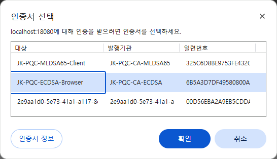
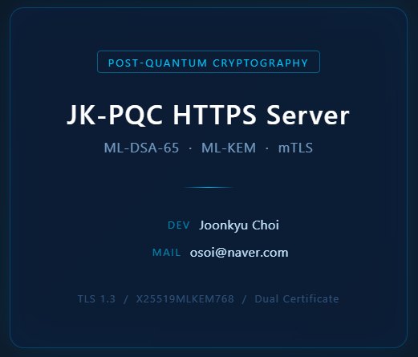
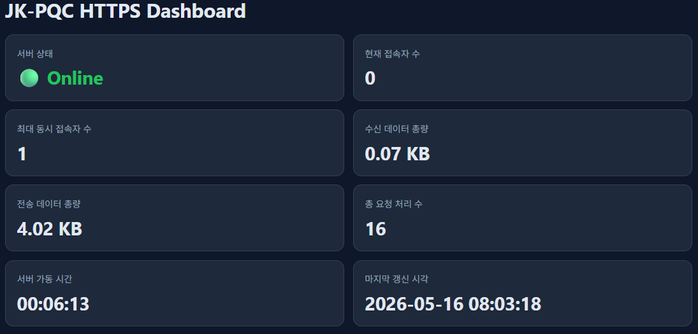

# JK's PQC(양자내성암호) 인증 시스템 구축 및 개발

본 프로젝트는 여러 AI 자동화 툴과 IDE 환경을 활용하여, `PQC를 적용한 차세대 보안 인증 시스템`을 구축한 것입니다.  
구축 절차와 소스 코드는 모두 공개되어 있습니다.  
현재의 소스 코드는 대략 `AI=95%, 저작자=5%`로, `Cursor + MSVC2022` 환경에서 C++ 언어로 개발되었습니다.

본 프로젝트의 산출물들 중에서, 아래의 자료들은 공개하지 않습니다:
- `AI 에이전트`에게 사용한 지침, 규칙, 지령문
- `검색, 기획, 설계` 자료들
- `Python CLI 번역툴`의 소스 코드

본 프로젝트는 Windows 시스템의 MSVC2022 개발 환경에서, 아래의 오픈소스 라이브러리들을 빌드하고 종속시켜 사용합니다.
- openssl (3.5.4) : https://github.com/openssl/openssl/tree/openssl-3.5.4
- liboqs (0.13.0) : https://github.com/open-quantum-safe/liboqs/tree/0.13.0
- oqs-provider (0.9.0) : https://github.com/open-quantum-safe/oqs-provider/tree/0.9.0
- cpp-httplib (0.40.0) : https://github.com/ggml-org/llama.cpp/tree/master/vendor/cpp-httplib

---

## 목차
- [전체 폴더/파일 구성](#전체-폴더파일-구성)
- [개발 범위](#개발-범위)
  - [구현 기능](#구현-기능)
  - [`Hybrid`란?](#hybrid란)
  - [구현 어플들](#구현-어플들)
  - [브라우저 접속 화면들](#브라우저-접속-화면들)
- [개발 환경 구성](#개발-환경-구성)
  - [터미널에 MSVC 컴파일러 활성화](#터미널에-msvc-컴파일러-활성화)
  - [Cursor 구축 및 활용](#cursor-구축-및-활용)
  - [종속 라이브러리들 빌드·구축](#종속-라이브러리들-빌드구축)
- [개발 정리](#개발-정리)
  - [구현 프로젝트들](#구현-프로젝트들)
  - [인증서 체계 구축](#인증서-체계-구축)
  - [솔루션 빌드](#솔루션-빌드)
  - [`jk-https-server` 콘솔 옵션](#jk-https-server-콘솔-옵션)
  - [주요 폴더/파일 설명](#주요-폴더파일-설명)
  - [실행 절차](#실행-절차)
  - [결과 로그](#결과-로그)

---

## 전체 폴더/파일 구성
[상세 보기](docs/Files-Structure.md)

---

## 개발 범위
PQC는 "연구 및 시제품" 용으로, 완제품 환경에서 민감한 데이터 보호에, 단독으로 사용하는 것은 아직 권장하지 않습니다.  
현시점 권장 접근은 **Hybrid 방식**(기존 RSA/ECC + PQC 병행)을 보안을 중시하는 국방·금융·방산·항공·공공기관 분야에서, 우선적으로 추진하고 있습니다.

공식적인 OID 미등록 문제로, `Hybrid PKI` 구현은 어려우며, `Hybrid Cert/KEM/mTLS`까지만 구현시킬 수 있습니다.  
본 프로젝트는 PQC를 적용시킨 인증 서버와 클라이언트를 개발하였습니다.

### 구현 기능
- **이중 인증서**:  
  기본적으로, `ML-DSA-65` PQC 인증서를 내장하며, 고전 `ECDSA` 인증서도 포함시켜, `Hybrid 인증서` 모방 체계를 구축합니다.  
  자세한 사항은 [인증서 체계 구축](./docs/Making-Certs.md#인증서-체계-구축)을 참조하세요.
- **Hybrid KEM**:  
  PQC 인증은 2가지 단계에 적용시켜 수행하게 됩니다.
  * 서명: MLDSA
  * 키교환: MLKEM

  `Hybrid KEM`은 키교환 단계에서, 클라이언트가 PQC (MLKEM)를 지원하지 않으면, 고전 X25519로 폴백하여 인증을 시도하는 방식을 의미합니다.
- **mTLS**:  
  일반 TLS (HTTPS)는 클라이언트가 서버의 신원만 확인(단방향 인증)하지만, mTLS는 서버도 클라이언트의 신원을 확인(양방향 인증)합니다.  
  mTLS 서버에, 브라우저로 인증에 성공하려면, `서버와 동일한 CA에서 발급한 인증서`를 로컬 시스템에 등록시켜야 가능합니다.  
  이에 대한, 상세한 정보는 [mTLS를 위한, `클라이언트 인증서` 등록하기](./docs/Making-Certs.md#mtls를-위한-클라이언트-인증서-등록하기)를 참조하세요.

### `Hybrid`란?
서버가 클라이언트의 `PQC 지원 여부`를 판단하여, (PQC로 동작할지 고전 방식으로 동작할지를) 자동으로 대처하는 것을 의미합니다.  
특히, 현재(2026.05) 시점에서 브라우저의 PQC 인증은 `서명 단계`는 지원되지 않으며, 몇몇 대표적인 최신 브라우저만 `키교환 단계`에서 PQC를 지원하고 있습니다.  
그래서, PQC 인증의 2가지 단계에 대하여, Hybrid 용어가 적용되어 있습니다.
- Hybrid DSA (인증서)
- Hybrid KEM (키교환)

mTLS의 경우, 양방향 상호 TLS 인증을 의미하며, 여기에 PQC를 적용시킨 것을 `Hybrid mTLS`로 불립니다.

`완전한 PQC 인증`은 특수 제작한 C/S 어플 간에만, 정상적으로 인증을 수행할 수 있습니다.  
예시:
| 서버            | 클라이언트      |
| --------------- | --------------- |
| jk-mtls-server  | jk-mtls-client  |
| jk-https-server | jk-https-client |

### 구현 어플들
- `jk-mtls-server`, `jk-mtls-client` 어플들은 HTTPS를 구현하기 전에, TCP 통신용으로 구현해 본 것입니다.  
  사전 데모 용도라서, 많은 기능들이 누락되었으니, 참고용으로만 사용하세요.
- `jk-https-server`, `jk-https-client` 어플들이 HTTPS로 `Hybrid mTLS` 인증을 구현한 것입니다.
- `jk-https-dashboard`는 일반 TLS로 구현된 (실시간 접속정보 감시용) 대시보드 API서버입니다.

### 브라우저 접속 화면들
`Hybrid mTLS` 서버(jk-https-server)에 브라우저로 접속하려면, `--single-cert` 옵션을 제외시킨 `이중 인증서`모드로 서버를 구동시킨 경우에 가능합니다.

아래의 이미지는 `Hybrid mTLS` 서버에, 브라우저(https://localhost:18080/)로 접속 시, `클라이언트 인증서 선택창`의 출력 화면입니다.  


아래의 이미지는 `Hybrid mTLS` 서버에, 브라우저(https://localhost:18080/)로 접속 시, `인증 완료`된 응답의 출력 화면입니다.  


아래의 이미지는 `일반 TLS` 대시보드 서버에, 브라우저(https://localhost:18081/)로 접속 시, 실시간 응답 화면입니다.  


---

## 개발 환경 구성

### 터미널에 MSVC 컴파일러 활성화
자신의 시스템에 설치된 경로를 확인하여 적용하세요.
```bash
# Community 2022 경로
"D:\Program Files\Microsoft Visual Studio\2022\Community\VC\Auxiliary\Build\vcvarsall.bat" x64
# 또는 Build Tools 2022 경로
"D:\Program Files (x86)\Microsoft Visual Studio\2022\BuildTools\VC\Auxiliary\Build\vcvarsall.bat" x64
```

### 브라우저 PQC 지원 처리
1.  브라우저에서 주소란에 `about:flags` 입력
2.  "Post-Quantum Key Exchange" 또는 "Post-Quantum Cryptography for Certificates" 항목 활성화 (Enabled)
    ```
    WebCrypto PQC
    Enables Post-Quantum Cryptography (PQC) algorithms (ML-DSA and ML-KEM) and ChaCha20-Poly1305 in WebCrypto. – Mac, Windows, Linux, ChromeOS, Android
    ```

### Cursor 구축 및 활용
[상세 보기](docs/Cursor-Settings.md)

### 종속 라이브러리들 빌드·구축
[상세 보기](./docs/Build-Dependencies.md)

---

## 개발 정리

### 구현 프로젝트들
- `mTLS + PQC + TCP` 인증
  * jk-mtls-server
  * jk-mtls-client
- `mTLS + PQC + HTTPS` 인증
  * jk-https-server
  * jk-https-client
- `실시간 통계` 서비스
  * jk-https-dashboard : `jk-https-server`의 대시보드 API 서버

### 인증서 체계 구축
[상세 보기](./docs/Making-Certs.md#인증서-체계-구축)

`Hybrid KEM` (X25519MLKEM768) 적용:  
현재 OpenSSL-3.5.4 버전은 아래의 `Hybrid KEM`들을 지원하고, TLS 1.3용으로 정의하며, Standards Track으로 표준을 진행중입니다.
- X25519MLKEM768
- X448MLKEM1024
- SecP256r1MLKEM768
- SecP384r1MLKEM1024

### 솔루션 빌드
`JK-PQC/build/msvc2022/JK-PQC.sln` 파일을 열고, 빌드하면 됩니다.  
또는 콘솔창에서:
```bash
$ MSBuild.exe JK-PQC\build\msvc2022\JK-PQC.sln /p:Configuration=Debug /p:Platform=x64
```

### `jk-https-server` 콘솔 옵션
```
--kem <groups>  사용할 KEM 그룹 목록 설정 (예: X25519MLKEM768:SecP256r1MLKEM768:X25519)
--single-cert   ML-DSA 인증서만 수용 (이중 인증서 비활성화)
--no-mtls       일반 TLS 동작 (클라이언트 인증서 불필요)
--help          도움말 출력
```

### 주요 폴더/파일 설명
```
JK-PQC/
  ├── bin/
  │   └── msvc/
  │       ├── Debug/
  │       │   ├── jk-https-dashboard.exe     # jk-https-dashboard.vcxproj 프로젝트의 Debug모드 빌드 결과물
  │       │   ├── jk-https-client.exe        # jk-https-client.vcxproj    프로젝트의 Debug모드 빌드 결과물
  │       │   ├── jk-https-server.exe        # jk-https-server.vcxproj    프로젝트의 Debug모드 빌드 결과물
  │       │   ├── jk-mtls-client.exe         # jk-mtls-client.vcxproj     프로젝트의 Debug모드 빌드 결과물
  │       │   └── jk-mtls-server.exe         # jk-mtls-server.vcxproj     프로젝트의 Debug모드 빌드 결과물
  │       └── Release/
  │            ├── jk-https-dashboard.exe     # jk-https-dashboard.vcxproj 프로젝트의 Release모드 빌드 결과물
  │            ├── jk-https-client.exe        # jk-https-client.vcxproj    프로젝트의 Release모드 빌드 결과물
  │            ├── jk-https-server.exe        # jk-https-server.vcxproj    프로젝트의 Release모드 빌드 결과물
  │            ├── jk-mtls-client.exe         # jk-mtls-client.vcxproj     프로젝트의 Release모드 빌드 결과물
  │            └── jk-mtls-server.exe         # jk-mtls-server.vcxproj     프로젝트의 Release모드 빌드 결과물
  ├── build/
  │   └── msvc2022/
  │       ├── JK-PQC.sln                      # MSVC2022 솔루션 파일
  │       └── projects/
  │           ├── jk-https-dashboard.vcxproj  # "mTLS + PQC + HTTPS" 대시보드 서버 콘솔앱 MSVC 프로젝트
  │           │                                 #   → [ECDSA P-256] 파일맵 공유 메모리의 실시간 트래픽 데이터를 브라우저에 서비스
  │           ├── jk-https-client.vcxproj     # "mTLS + PQC + HTTPS" 인증 클라이언트 콘솔앱 MSVC 프로젝트
  │           ├── jk-https-server.vcxproj     # "mTLS + PQC + HTTPS" 인증 서버 콘솔앱 MSVC 프로젝트
  │           │                                 #   → [ML-DSA-65] 실시간 트래픽 데이터를 파일맵 공유 메모리에 저장
  │           ├── jk-mtls-client.vcxproj      # "mTLS + PQC + TCP" 인증 클라이언트 콘솔앱 MSVC 프로젝트
  │           └── jk-mtls-server.vcxproj      # "mTLS + PQC + TCP" 인증 서버 콘솔앱 MSVC 프로젝트
  ├── certs/                            # 인증서 루트 폴더
  │   ├── ecdsa/                       # [ECDSA] 인증서 루트
  │   │   ├── ca/                     # [ECDSA] 루트 CA
  │   │   │   ├── ca-cert.pem        # 루트 CA 인증서 (공개) — 클라이언트 배포용
  │   │   │   ├── ca-cert.srl        # 루트 CA 서명 일련번호 (자동 관리)
  │   │   │   └── ca-key.pem         # 루트 CA 개인키 (절대 유출 금지)
  │   │   ├── browser/                # 브라우저 전용
  │   │   │   ├── client.p12         # 브라우저용 클라이언트 인증서 패키지 — Windows 설치용
  │   │   │   ├── client-cert.pem    # 브라우저용 클라이언트 인증서 (공개)
  │   │   │   ├── client-key.pem     # 브라우저용 클라이언트 개인키 (절대 유출 금지)
  │   │   │   └── client.csr         # 브라우저용 클라이언트 인증서 서명 요청 (임시)
  │   │   └── server/                 # jk-https-server 전용
  │   │        ├── server-cert.pem    # 서버 인증서 (공개) — PQC 미지원 클라이언트 제공용
  │   │        ├── server-cert.srl    # 서버 인증서 서명 일련번호 (자동 관리)
  │   │        └── server-key.pem     # 서버 개인키 (절대 유출 금지)
  │   │
  │   ├── ca/                          # [MLDSA] 루트 CA
  │   │   ├── client.p12              # PQC 지원 브라우저용 클라이언트 인증서 패키지 — Windows 설치용 (PQC 지원 브라우저 확인용)
  │   │   ├── ca-cert.pem             # 루트 CA 인증서 (ML-DSA-65 서명, 자체 서명, 유효기간 10년)
  │   │   │                             #   → 서버/클라이언트 인증서 검증 시 신뢰 앵커로 사용
  │   │   ├── ca-cert.srl             # CA 서명 시 자동 생성되는 인증서 일련번호 파일
  │   │   │                             #   → 다음 서명 시 중복 방지용 (텍스트, 16진수 일련번호)
  │   │   └── ca-key.pem              # 루트 CA 개인키 (ML-DSA-65, 외부 노출 금지)
  │   │                                  #   → 서버/클라이언트 CSR 서명에만 사용
  │   │
  │   ├── client/                      # [MLDSA] jk-mtls-client / jk-https-client 공용
  │   │   ├── client-cert.pem         # 클라이언트 인증서 (CA 서명, EKU=clientAuth, 유효기간 1년)
  │   │   │                             #   → mTLS 핸드셰이크 시 서버에 제출하여 신원 증명
  │   │   ├── client-key.pem          # 클라이언트 개인키 (ML-DSA-65, 외부 노출 금지)
  │   │   │                             #   → TLS 핸드셰이크 서명 및 상호 인증에 사용
  │   │   └── client.csr              # 클라이언트 인증서 서명 요청서 (CA 서명 후 보관용)
  │   │                                  #   → 인증서 갱신 시 재사용 가능
  │   │
  │   ├── dashboard/                   # [ECDSA] jk-https-dashboard 전용 (CA/인증서/개인키)
  │   │   ├── dashboard-ca-cert.pem   # 대시보드 전용 루트 CA 인증서 (ECDSA P-256, 자체 서명, 유효기간 10년)
  │   │   │                             #   → 브라우저 HTTPS 접속 시 신뢰 앵커로 사용 (별도 CA 분리)
  │   │   ├── dashboard-ca-cert.srl   # 대시보드 CA 서명 시 자동 생성되는 인증서 일련번호 파일
  │   │   ├── dashboard-ca-key.pem    # 대시보드 전용 CA 개인키 (ECDSA P-256, 외부 노출 금지)
  │   │   │                             #   → dashboard-cert.pem 서명에만 사용
  │   │   ├── dashboard-cert.pem      # 대시보드 서버 인증서 (대시보드 CA 서명, EKU=serverAuth, 유효기간 1년)
  │   │   │                             #   → SAN: DNS:localhost, IP:127.0.0.1 포함
  │   │   │                             #   → 브라우저 ↔ 대시보드 서버 HTTPS 통신에 사용
  │   │   ├── dashboard-key.pem       # 대시보드 서버 개인키 (ECDSA P-256, 외부 노출 금지)
  │   │   └── dashboard.csr           # 대시보드 서버 인증서 서명 요청서 (CA 서명 후 보관용)
  │   │
  │   └── server/                      # [MLDSA] jk-mtls-server / jk-https-server 공용
  │       ├── server-cert.pem          # 서버 인증서 (CA 서명, EKU=serverAuth, 유효기간 1년)
  │       │                              #   → SAN: DNS:localhost, IP:127.0.0.1 포함
  │       │                              #   → mTLS 핸드셰이크 시, 클라이언트에 제출하여 신원 증명
  │       ├── server-key.pem           # 서버 개인키 (ML-DSA-65, 외부 노출 금지)
  │       │                              #   → TLS 핸드셰이크 서명 및 상호 인증에 사용
  │       └── server.csr               # 서버 인증서 서명 요청서 (CA 서명 후 보관용)
  │                                       #   → 인증서 갱신 시, 재사용 가능
  └── src/
      ├── clients/                      # 클라이언트 어플 관련 소스코드 폴더
      │   ├── jk-https-client.cpp      # "mTLS + PQC + HTTPS" 인증 클라이언트 시작 파일
      │   └── jk-mtls-client.cpp       # "mTLS + PQC + TCP" 인증 클라이언트 시작 파일
      ├── common/                       # 공통 소스코드 폴더
      │   ├── https.h                  # "mTLS + PQC + HTTPS" 통신 클래스(CHttpsBase/CHttpsServer/CHttpsClient) 정의
      │   ├── https.cpp                # "mTLS + PQC + HTTPS" 통신 클래스(CHttpsBase/CHttpsServer/CHttpsClient) 구현
      │   ├── pqc_utils.h              # PQC 초기화, oqs-provider 로드 등 공통 유틸 정의
      │   ├── pqc_utils.cpp            # PQC 초기화, oqs-provider 로드 등 공통 유틸 구현
      │   ├── shm_stats.h              # "jk-https-server 실시간 통계정보" 공유메모리 클래스(CShmStatsProducer) 정의
      │   └── shm_stats.cpp            # "jk-https-server 실시간 통계정보" 공유메모리 클래스(CShmStatsProducer) 구현
      ├── servers/                      # 서버 어플 관련 소스코드 폴더
      │   ├── jk-https-server.cpp      # "mTLS + PQC + HTTPS" 인증 서버 시작 파일
      │   ├── jk-mtls-server.cpp       # "mTLS + PQC + TCP" 인증 서버 시작 파일
      │   ├── jk-https-dashboard.cpp   # "mTLS + PQC + HTTPS" 대시보드 서버 시작 파일
      │   ├── shm_consumer.h           # "jk-https-dashboard 공유메모리 통계" 리더 클래스(CShmStatsConsumer) 정의
      │   └── shm_consumer.cpp         # "jk-https-dashboard 공유메모리 통계" 리더 클래스(CShmStatsConsumer) 구현
      └── tests/                        # 테스트 어플 관련 소스코드 폴더
           └── test_provider.c          # OpenSSL용 [oqsprovider] 로드 테스트
```

### 실행 절차
경로 문제로, 루트 폴더에서 실행시켜야 합니다.
```bash
$ cd D:\E\Study\AI\AutoAgents\projects\JK-PQC
# "mTLS + PQC + TCP" 인증 테스트 (8443)
$ bin\msvc\Debug\jk-mtls-server
$ bin\msvc\Debug\jk-mtls-client

# "mTLS + PQC + HTTPS" 인증 테스트 (18080)
$ bin\msvc\Debug\jk-https-server
$ bin\msvc\Debug\jk-https-client
$ bin\msvc\Debug\jk-https-client --kem SecP256r1MLKEM768
$ bin\msvc\Debug\jk-https-client --kem X25519

# 리슨 포트 확인
$ netstat -anop tcp | find "1808"

# "mTLS + PQC + HTTPS" 모니터링 (18081)
$ bin\msvc\Debug\jk-https-dashboard
# 브라우저에서, https://localhost:18081 접속
```

### OpenSSL 클라이언트로 테스트
`jk-https-server` 구동된 상태에서, 아래의 명령들을 수행한다.
```bash
# Hybrid KEM 테스트
$ openssl s_client -connect localhost:18080 -groups X25519MLKEM768 -cert certs\client\client-cert.pem -key certs\client\client-key.pem -CAfile certs\ca\ca-cert.pem -provider oqsprovider -provider default
# SecP256r1MLKEM768 폴백 테스트
$ openssl s_client -connect localhost:18080 -groups SecP256r1MLKEM768 -cert certs\client\client-cert.pem -key certs\client\client-key.pem -CAfile certs\ca\ca-cert.pem -provider oqsprovider -provider default
# X25519 폴백 테스트 (고전 알고리즘)
$ openssl s_client -connect localhost:18080 -groups X25519 -cert certs\client\client-cert.pem -key certs\client\client-key.pem -CAfile certs\ca\ca-cert.pem -provider oqsprovider -provider default
```

### 결과 로그
[상세 보기](./docs/log-https-apps.md)

---

## License

[](LICENSE)
